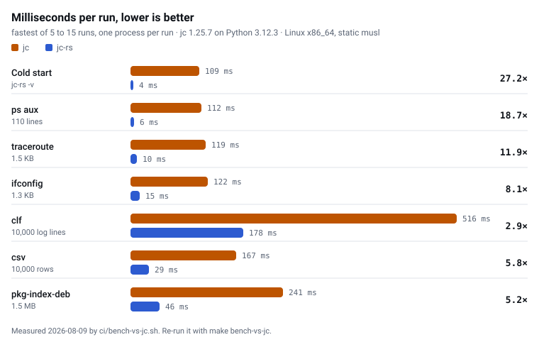

# jc-rs

Convert the output of command-line tools, file formats and strings to JSON, from
a single static binary.

```console
$ ps aux | jc-rs --ps | jq '.[0]'
$ df -h   | jc-rs --df
$ dig example.com | jc-rs -p --dig
```

> Compatibility with jc: **100%** (934 of 934 oracle-valid fixture pairs).
> The code this started from measured 80.0%. The number comes from
> `make differential` and is published whatever it says. See
> [tests/differential/REPORT.md](tests/differential/REPORT.md).
> CI fails below 100%, so it cannot quietly drift.

---

## Why this project exists

jc is the standard for this job and the reason the category exists. It decided
which commands are worth parsing and what the JSON for each should look like.
Its one weakness is the Python runtime: ~160 ms of startup on every invocation,
and a dependency you cannot put in a `scratch` container or on an embedded box.

jc-rs is that tool as a single static binary:

1. A compatibility number you can check. Every fixture jc ships enters the
   denominator, including the awkward ones, and CI fails below 100%. jc-rs
   invents no schemas: jc is the authority, and where the two disagree jc-rs has
   the bug.
2. Streaming that actually streams. jc emits NDJSON line-by-line as input
   arrives, and so does jc-rs: `tail -f access.log | jc-rs -u --clf-s` prints
   each record as the log grows, rather than one array at EOF.
3. Distribution. Static binaries for five targets, five crates, npm, brew and
   a `scratch` Docker image.

## How the compatibility number is produced

`tests/differential/validate.py` walks every `.json` fixture in the pinned jc
source (submodule at `./jc`, currently **v1.25.7**) and applies one rule:

> A fixture pair enters the denominator **only when jc itself reproduces that
> fixture exactly.**

Everything that does not qualify is reported by category (`oracle_reject`,
`unmapped`, `no_input`) and never dropped from the count.

Two details decide whether the number means anything:

- `tests/fixtures/` is a verbatim mirror of the submodule, enforced by
  `make check-fixtures`. If this repo could edit its own copy, a failing parser
  could be made to pass by rewriting the expected output.
- The run is pinned to `TZ=PST8PDT`, which is what jc's own `runtests.sh` uses.
  jc's fixtures carry `*_epoch` fields computed in local time; in any other zone
  the oracle rejects every timestamp-bearing fixture and 146 pairs quietly leave
  the denominator.

```console
$ make differential
jc 1.25.7 · 943 pairs · 236 parsers known
match 934 · mismatch 0 · error 0
match rate over oracle-valid pairs: 100.0%  (934 pairs)
reported but not tested: oracle_reject=9 unmapped=149 no_input=18
```

## Speed

**5 ms instead of 108.** Every scenario below is faster, from 3.2× on a
10,000-line log to 21.6× at startup.

One harness times both sides on the same inputs, one process per run, fastest of
5 to 15: [`ci/bench-vs-jc.sh`](ci/bench-vs-jc.sh), against jc 1.25.7 on Python
3.12, Linux x86-64. `make bench-vs-jc` reruns it on your machine and rewrites
both the chart and the [dataset](website/src/data/benchmarks.json) the site
reads, so every figure here traces back to a run of that script.

<picture>
  <source media="(prefers-color-scheme: dark)" srcset="docs/bench-dark.svg">
  
</picture>

| Scenario | jc | jc-rs | Speedup |
|---|---|---|---|
| Cold start (`-v`) | 108 ms | 5 ms | **21.6×** |
| `ps aux`, 110 lines | 121 ms | 7 ms | **17.3×** |
| `traceroute`, 1.5 KB | 128 ms | 10 ms | **12.8×** |
| `ifconfig`, 1.3 KB | 138 ms | 15 ms | **9.2×** |
| `pkg-index-deb`, 1.5 MB | 238 ms | 37 ms | **6.4×** |
| `csv`, 10,000 rows | 153 ms | 30 ms | **5.1×** |
| `clf`, 10,000 log lines | 547 ms | 173 ms | **3.2×** |

Startup is where the gap is widest, and startup is what a loop pays. Over 200
hosts, jc spends 21 seconds inside the Python interpreter before parsing a byte;
jc-rs spends one. That is the difference between a git hook you notice and one
you do not. On bulk throughput the lead settles at 3× to 6×, where both are
bound by the same per-field work.

Those are whole-process timings, which is how a CLI is used. Parse repeatedly in
one process — the [`jc-rs-wasm`](crates/jc-rs-wasm) converter on the front page,
a library caller, `--slurp` — and the per-parse cost collapses further still:
`iwconfig` is 129× faster than it was last release, `ifconfig` 65×, `ps` 3.4×.
`make bench` reports that side.

## Usage

Same interface as jc.

```sh
# standard syntax
df -h    | jc-rs --df
ps aux   | jc-rs --ps
mount    | jc-rs --yaml-out --mount

# magic syntax: jc-rs runs the command itself
jc-rs -p df -h
jc-rs -p /proc/meminfo

# line slicing (zero-based, exclusive end)
cat log.txt | jc-rs 2: --syslog

# streaming: one JSON object per record, as it arrives (-u to flush per line)
tail -f access.log | jc-rs -u --clf-s
ping example.com  | jc-rs -u --ping-s

# with jq
ss -tlnp | jc-rs --ss | jq '[.[].local_port] | unique'
```

## Crates

| Crate | What |
|---|---|
| [`jc-rs`](crates/jc-rs) | the CLI binary |
| [`jc-rs-core`](crates/jc-rs-core) | parser traits, output and error types, registry |
| [`jc-rs-parsers`](crates/jc-rs-parsers) | every parser; the reuse surface for other tools |
| [`jc-rs-utils`](crates/jc-rs-utils) | shared helpers: column tables, coercion, key normalisation |
| [`jc-rs-wasm`](crates/jc-rs-wasm) | `wasm-bindgen` wrapper + npm package |

The binary is `jc-rs`, not `jc`. Release archives contain a `jc` alias you can
enable deliberately; nothing installs it by default, because it would shadow the
original jc in `PATH`.

## Use it as a library

```rust
let output = jc_rs_parsers::parse("df", df_output)?;

// Streaming parsers hand back a session you feed a line at a time.
let mut session = jc_rs_parsers::session("clf_s").unwrap();
for line in reader.lines() {
    if let Some(record) = session.parse_line(&line?, true)? {
        handle(record);
    }
}
```

Parsers register themselves at link time, so depending on `jc-rs-parsers` is
what fills the registry. `parse`, `find`, `parsers` and `session` exist so you
never have to think about that.

## Shell completions

```sh
jc-rs -B > /etc/bash_completion.d/jc-rs
jc-rs -Z > "${fpath[1]}/_jc-rs"
jc-rs -F > ~/.config/fish/completions/jc-rs.fish
```

## Install

```sh
cargo binstall jc-rs                    # prebuilt binary, no compile
cargo install jc-rs                     # from source
brew install OlegSotnikov/tap/jc-rs     # macOS and Linux
npm install jc-rs-wasm                  # WebAssembly, browser or Node
docker pull appmasterio/jc-rs           # container, see below
```

Or take a static binary straight from the
[releases](https://github.com/OlegSotnikov/jc-rs/releases): five targets, with
completions for bash, zsh and fish, a `jc` alias and `SHA256SUMS` in every
archive.

### Docker

[`appmasterio/jc-rs`](https://hub.docker.com/r/appmasterio/jc-rs) on Docker Hub.
A `scratch` image, 2.3 MB compressed: the binary and its licence, with no shell,
no libc and no package manager. `linux/amd64` and `linux/arm64` ship in one
manifest, so `docker pull` picks the right one.

| Tag | What |
|---|---|
| [`latest`](https://hub.docker.com/r/appmasterio/jc-rs/tags?name=latest) | the most recent release |
| [`vX.Y.Z`](https://hub.docker.com/r/appmasterio/jc-rs/tags) | a specific release |

```console
$ ps aux | docker run --rm -i appmasterio/jc-rs --ps | jq '.[0]'
$ docker run --rm -i appmasterio/jc-rs --df < df.txt
$ tail -f access.log | docker run --rm -i appmasterio/jc-rs -u --clf-s
```

Magic syntax (`jc-rs df -h`) needs the command inside the container, and this
image deliberately has nothing else in it. Pipe instead, or use the standalone
binary.

## Build from source

```console
git clone --recurse-submodules https://github.com/OlegSotnikov/jc-rs.git
cd jc-rs
make build          # cargo build --release
make check          # lint + fixture sync + tests + full differential run
```

The differential suite needs the jc submodule and the Python packages jc's own
parsers use: `make submodule deps-py`.

## License

MIT. See [LICENSE](LICENSE).

---

<sub>jc-rs implements the JSON schemas defined by [jc](https://github.com/kellyjonbrazil/jc), the original Python tool. MIT.</sub>
